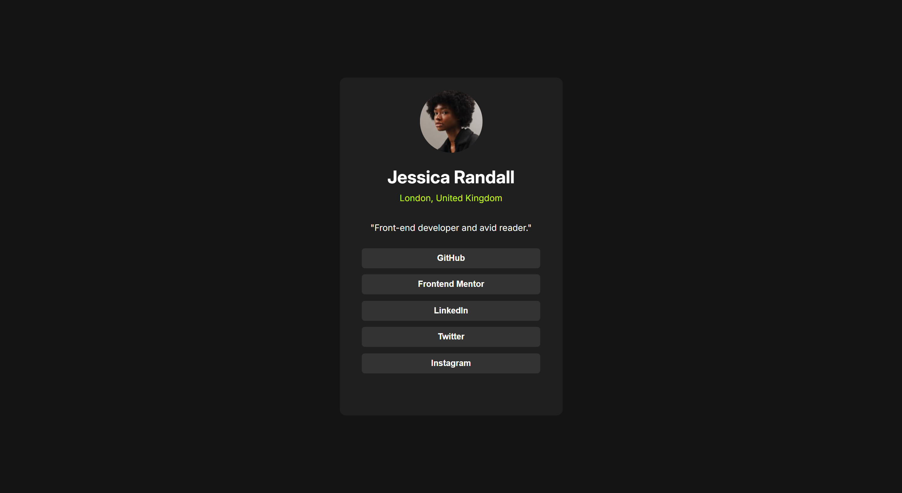
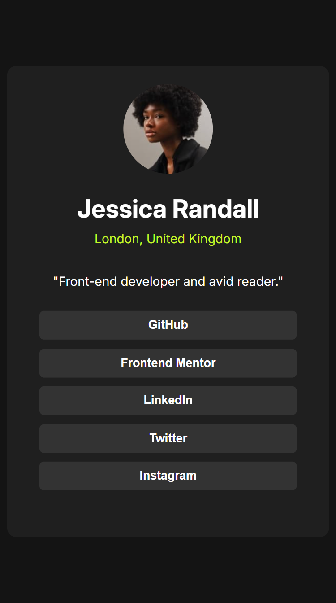
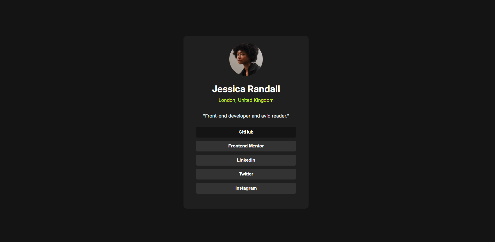
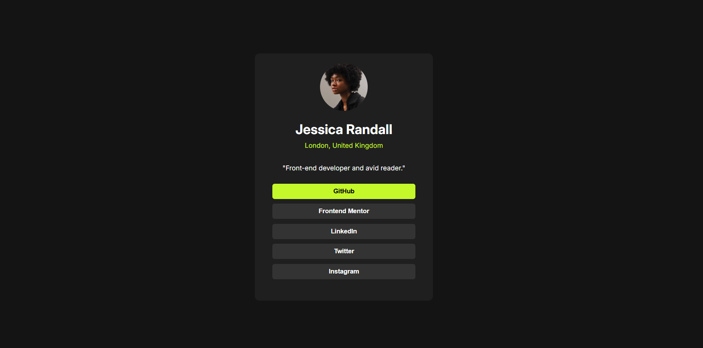

# Frontend Mentor - Social links profile solution

## Table of contents

- [Overview](#overview)
  - [The goal](#the-challenge)
  - [Screenshot](#screenshot)
- [My process](#my-process)
  - [Built with](#built-with)
  - [What I learned](#what-i-learned)
  

## Overview
  This is a simple Social links profile and adaptable to desktop and mobile view. Screenshots of the pages has attached in the image folder.

### The goal

  1. To make desktop and mobile adaptable views.
  2. To show the hover effect.
  3. To show the focus state effect when user clicks on the button.

### Screenshot

  - Desktop view image:
      
  
  - Mobile-view image:
      
  
  - Hover view image:
      
  
  - focus state view image:
      

## My process
  1. used all HTML Semantic to structure all the text.
  2. applied all the basic CSS properties.
  3. focused on responsivness. for that i used grid and media query.
  4. applied CSS properties for hover effect and focus state. 

### Built with

- Semantic HTML5 markup
- CSS custom properties
- Media query
- CSS Grid
  
### What I learned

  - I learned how to implement the responsiveness, the hover effect and also focus state.

